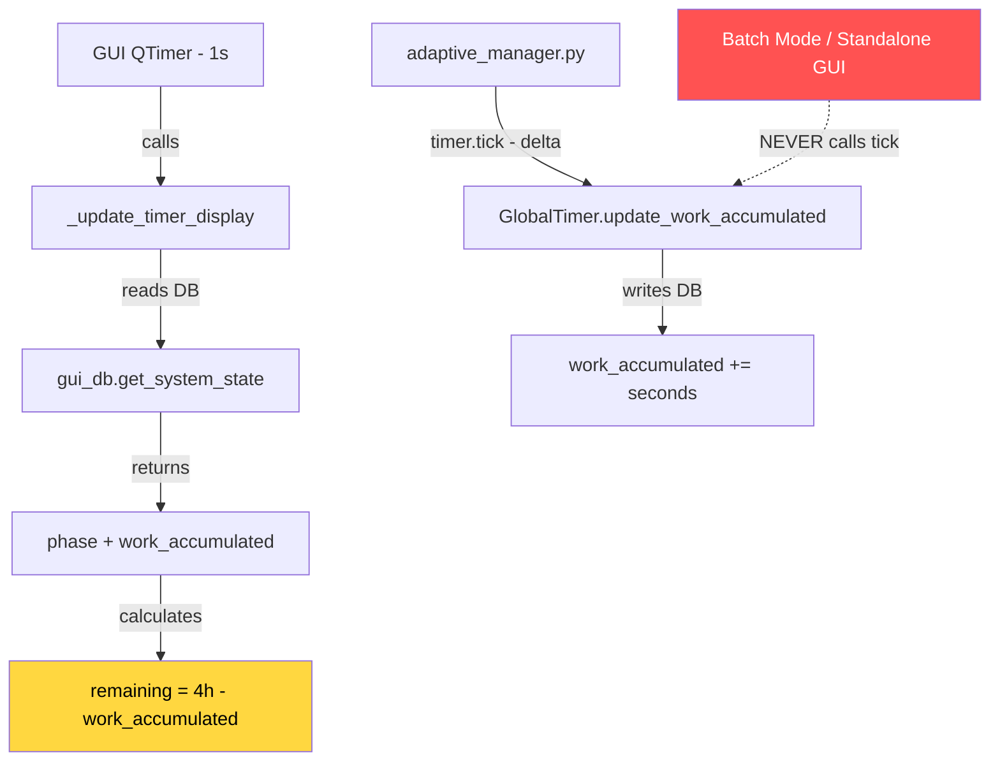

# Fix: Worker Timer Countdown Not Working in GUI

## Problem

The global timer countdown in the GUI (`⏱ Global Timer` section) does not count down during the **WORKING** phase. It stays stuck at `Rest in: 4:00:00` indefinitely.

## Root Cause

The GUI's 1-second QTimer at [`gui_app.py:57-59`](gui_app.py:57) calls [`_update_timer_display()`](gui_app.py:682) every second, but this method **only reads** the timer state from the DB — it never **writes/updates** it.

The `work_accumulated` value in the `system_state` table is only incremented by [`adaptive_manager.py`](adaptive_manager.py:102-104) via `timer.tick(delta)`. When the GUI runs without the adaptive manager (e.g., in Batch mode or standalone), nothing increments `work_accumulated`, so the countdown never changes.

### Data Flow Diagram



### Why RESTING countdown works but WORKING does not

- **RESTING phase**: Countdown uses `time.time() - last_transition_time` — a real-time calculation that doesn't need DB writes. Works correctly.
- **WORKING phase**: Countdown uses `work_duration - work_accumulated` — requires `work_accumulated` to be periodically updated. **Never updated by GUI.**

## Fix

### Change 1: Import GlobalTimer in gui_app.py

Add `GlobalTimer` import so the GUI can tick the timer.

**File**: `gui_app.py` line 28
```python
from timer_utils import GlobalTimer
```

### Change 2: Add timer instance and last-tick tracking to MainWindow.__init__

**File**: `gui_app.py` — in `__init__` around line 49

```python
# Global timer instance for GUI-side ticking
self._global_timer = GlobalTimer(work_duration=4*3600, rest_duration=1*3600)
self._last_tick_time = time.time()
```

### Change 3: Tick the timer in _update_timer_display before reading state

**File**: `gui_app.py` — in `_update_timer_display()` at line 682

Before reading state, calculate elapsed time since last tick and call `timer.tick()`:

```python
def _update_timer_display(self):
    """Refresh timer section from DB."""
    # Tick the global timer to keep work_accumulated current
    now = time.time()
    delta = now - self._last_tick_time
    self._last_tick_time = now
    if delta > 0 and delta < 10:  # Sanity check: skip huge deltas
        self._global_timer.tick(delta)
    
    state = gui_db.get_system_state()
    # ... rest of method unchanged
```

### Change 4: Remove hardcoded durations, read from timer instance

**File**: `gui_app.py` — in `_update_timer_display()` lines 687-688

Replace:
```python
work_duration = 4 * 3600  # 4h
rest_duration = 1 * 3600  # 1h
```

With:
```python
work_duration = self._global_timer.work_duration
rest_duration = self._global_timer.rest_duration
```

## Files to Modify

| File | Change |
|------|--------|
| `gui_app.py` | Import `GlobalTimer`, add timer ticking in `_update_timer_display()` |

## Risk Assessment

- **Low risk**: The `tick()` method in `GlobalTimer` is idempotent and handles both WORKING and RESTING phases correctly.
- **No conflict with adaptive_manager**: If both the GUI and adaptive_manager tick the timer, `work_accumulated` will increment from both sources. This is acceptable because:
  - The adaptive_manager ticks every 2 seconds with the actual elapsed delta
  - The GUI ticks every 1 second with its own delta
  - They won't double-count because each tracks its own `last_tick_time`
  - Actually, they WILL double-count if both run simultaneously. We should guard against this.

### Double-counting guard

Only tick from the GUI when no manager process is actively ticking. Simple approach: only tick when `_active_mode` is `None` or `"batch"` (adaptive manager handles its own ticking).

```python
# Only tick from GUI if adaptive manager isn't running
# (adaptive manager ticks its own timer)
if self._active_mode != "adaptive":
    self._global_timer.tick(delta)
```

## Testing

1. Start GUI standalone → timer should count down from 4:00:00
2. Start Adaptive mode → timer should count down (ticked by manager)
3. Start Batch mode → timer should count down (ticked by GUI)
4. Force REST → rest countdown should work as before
5. After rest period → should auto-transition back to WORKING
